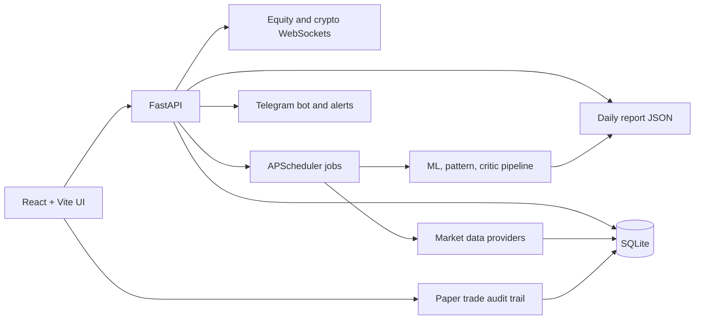

# Trader Koo

Evidence-first market research dashboard with daily reports, chart setups,
VIX/options/crypto views, actionable Telegram alerts, and a paper-trading audit
trail.

[Live app](https://trader.kooexperience.com) |
[Demo script](docs/demo.md) |
[Proof of real data](docs/proof.md) |
[Model versioning](docs/model-versioning.md) |
[Architecture](ARCHITECTURE.md)


> Trader Koo is research software. It keeps paper trading separate from real
> execution and shows source freshness so users can judge the data behind each
> view.

## Why It Is Useful

- **It shows evidence before claims.** Reports include source freshness,
  warnings, and stale-data flags.
- **It is a real product surface.** React, FastAPI, WebSockets, Telegram, daily
  reports, paper trades, alerts, and admin ops are wired into one workflow.
- **It separates research from execution.** Paper trading, prediction-market
  tracking, and Telegram actions stay clearly non-executing.
- **It is readable by engineers.** The repo has explicit architecture,
  model versioning, verification, security notes, and contribution paths.

## Run It Locally

```bash
git clone https://github.com/haomingkoo/trader-koo.git
cd trader-koo

python3.11 -m venv .venv
. .venv/bin/activate
make backend-install
make frontend-install
cp .env.example .env

# Terminal 1: API
ADMIN_STRICT_API_KEY=0 \
TRADER_KOO_DEVELOPMENT_MODE=1 \
TRADER_KOO_LOG_DIR=trader_koo/data/logs \
TRADER_KOO_REPORT_DIR=trader_koo/data/reports \
TRADER_KOO_LOGOS_DIR=trader_koo/data/logos \
uvicorn trader_koo.backend.main:app --reload --port 8000

# Terminal 2: UI
cd trader_koo/frontend-v2
npm run dev
```

Open the URL printed by Vite, usually `http://127.0.0.1:5173`.

For a guided walkthrough, use [docs/demo.md](docs/demo.md).

## Real vs Simulated

| Area | Status | Notes |
| --- | --- | --- |
| Daily equity data | Live/provider-backed | Uses configured market data sources and stored SQLite history. |
| Binance crypto data | Live/provider-backed | Public market data and streaming paths are wired. |
| VIX/macro context | Live/provider-backed where configured | Missing or stale data is surfaced in the UI. |
| Telegram alerts | Real notification channel | Requires `TELEGRAM_BOT_TOKEN` and `TELEGRAM_CHAT_ID`. |
| Paper trades | Simulated only | Uses research context and journal state; no broker order is sent. |
| Prediction markets | Public market discovery | Paper positions only; no wallet signer or real order flow. |
| Admin actions | Real app operations | Protected by API key outside explicit local dev mode. |

If a provider is unavailable, the app should show a degraded, stale, or
missing-provider state. That makes the data quality visible instead of hiding it
behind a polished answer.

## Product Tour

1. **Guide** - what the app does, what is paper-only, and how evidence flows.
2. **Report** - daily market report with source freshness and setup quality.
3. **Chart** - ticker workspace with levels, patterns, indicators, and notes.
4. **Opportunities** - ranked research candidates and setup filters.
5. **Paper Trades** - simulated trade journal with critic review and outcomes.
6. **Alerts** - Telegram alerts, market spikes, and system events.
7. **Markets** - VIX, options, crypto, Hyperliquid, and prediction-market views.
8. **Methodology** - architecture, model logic, and operational design.

## Architecture



Single-process deployment keeps the project easy to run: API server, scheduler,
WebSocket clients, static frontend, SQLite, reports, and logs live in one
service. See [ARCHITECTURE.md](ARCHITECTURE.md) for the full system map.

## Stack

| Layer | Technology |
| --- | --- |
| Backend | FastAPI, APScheduler, SQLite |
| Frontend | React 19, Vite, TypeScript, Tailwind |
| Charts | Plotly |
| ML/research | LightGBM, SHAP, rule-based pattern logic, validation reports |
| Data | yfinance, Finnhub, Binance, Finviz, FRED, Polymarket where configured |
| Notifications | Telegram Bot API |
| Deploy | Railway/Nixpacks, single service with persistent volume |

## Telegram

Telegram alerts are meant to move a user to the next useful screen. Commands
and alert buttons can open the chart, paper-trading review, or recent alert
list.

Required env:

```bash
TELEGRAM_BOT_TOKEN=
TELEGRAM_CHAT_ID=
TRADER_KOO_PUBLIC_BASE_URL=https://trader.kooexperience.com
```

Supported commands include `/status`, `/top`, `/price AAPL`, `/options`,
`/vix`, `/alerts`, and `/help`.

## Verification

```bash
make ci
npm run lint --prefix trader_koo/frontend-v2
npm run build --prefix trader_koo/frontend-v2
.venv/bin/python -m pytest tests/test_bot_commands.py
```

The current repo also keeps proof-oriented docs:

- [docs/proof.md](docs/proof.md) - source boundaries and verification evidence.
- [docs/model-versioning.md](docs/model-versioning.md) - model promotion gates,
  candidate runs, and paper-trade policy versions.
- [docs/demo.md](docs/demo.md) - 5-minute product walkthrough.
- [SECURITY.md](SECURITY.md) - security policy and reporting path.
- [CONTRIBUTING.md](CONTRIBUTING.md) - local development and PR expectations.

## Search Terms

Open source trading dashboard, paper trading journal, Telegram stock alerts,
VIX regime dashboard, options research, crypto dashboard, Hyperliquid whale
tracker, FastAPI React trading app, evidence-first market research, technical
analysis dashboard.

## License

MIT
